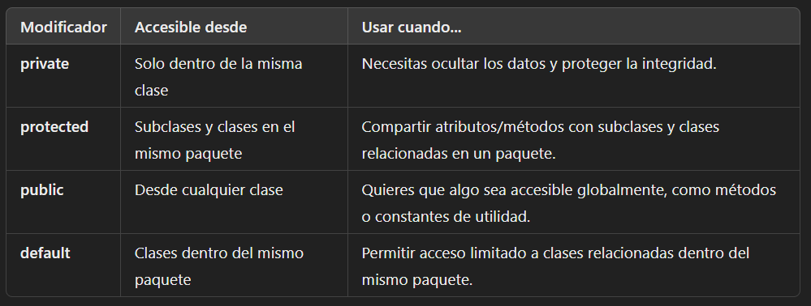

# **Modificadores de Acceso**
En Java, los controladores de acceso public, protected y private se utilizan para controlar la visibilidad y el acceso a variables, métodos y clases. Aquí te explico cuándo usar cada una y cómo elegir el modificador adecuado:

## **1. private**
Uso: Se utiliza para encapsular datos y métodos. Solo son accesibles dentro de la misma clase.
Cuándo usarlo:

* Cuando quieres *proteger la integridad de los datos* evitando accesos directos desde otras clases.
* Para implementar *encapsulación*, una buena práctica en la programación orientada a objetos.
* Para mantener los *detalles de implementación internos*.
Ejemplo:

```java
public class Persona {
    private String nombre; // Solo accesible dentro de esta clase
    private int edad;

    // Métodos públicos para acceder y modificar las variables privadas
    public String getNombre() {
        return nombre;
    }

    public void setNombre(String nombre) {
        this.nombre = nombre;
    }

    public int getEdad() {
        return edad;
    }

    public void setEdad(int edad) {
        if (edad > 0) { // Validación adicional
            this.edad = edad;
        }
    }
}
```


## **2. protected**
Uso: Permite el acceso a clases del mismo paquete y a las subclases, incluso si están en paquetes diferentes.
Cuándo usarlo:

* Cuando deseas que las subclases tengan acceso directo a los atributos o métodos, pero no otras clases que no sean relacionadas.
* Cuando implementas *herencia* y necesitas compartir datos entre la clase base y las *derivadas*.
Ejemplo:

```java
public class Animal {
    protected String tipo; // Accesible en subclases y dentro del paquete

    protected void hacerSonido() {
        System.out.println("El animal hace un sonido.");
    }
}

class Perro extends Animal {
    public void hacerSonido() {
        System.out.println("El perro ladra.");
    }
}
```


## **3. public**
Uso: Permite el acceso desde cualquier clase, sin restricciones.
Cuándo usarlo:

* Cuando necesitas que el método o variable sea accesible desde cualquier parte del programa.
* Para interfaces públicas o métodos que deben ser accesibles para todos los usuarios de una clase o biblioteca.
* Evita usarlo con atributos directamente, ya que puede comprometer la encapsulación.
Ejemplo:

```java
public class Calculadora {
    public int sumar(int a, int b) {
        return a + b;
    }

    public int restar(int a, int b) {
        return a - b;
    }
}
```


## **4. Sin modificador (default/package-private)**
Uso: Sin un modificador explícito, los elementos tienen visibilidad de paquete. Son accesibles solo dentro del mismo paquete.
Cuándo usarlo:

* Cuando trabajas con clases relacionadas en el mismo paquete.
* Para métodos o atributos que no deben ser visibles fuera del paquete, pero no necesitan ser completamente privados.
Ejemplo:

```java
class Vehiculo {
    String marca; // Default: accesible solo dentro del paquete

    void arrancar() {
        System.out.println("El vehículo está arrancando.");
    }
}
```

## **Resumen de uso recomendado**


## **Buenas prácticas**
1. Usa private por defecto para atributos: Aplica encapsulación y controla el acceso mediante getters/setters.
2. Usa protected para herencia: Permite compartir lógica entre clases relacionadas.
3. Usa public con moderación: Solo para métodos o constantes necesarias en el ámbito global.
4. Evita public en atributos: Compromete la seguridad y encapsulación del código.